# Qui dans l'assemblée...

::: notes

Test

:::

::: { .left }
::: incremental

* Fait du Rust

* Fait de l'embarqué

* Fait du parapente

* Enseigne

* N'a pas encore levé la main  :)

:::
:::

::: { .right style="font-size: 5em;" }
?
:::


# Enseignement du parapente { data-background-image="img/groupe_voiles_dune.jpg" }

## Progression en école
Petit groupe, encadrés par deux moniteurs

. . .

::: { .left }
**Pratique**

10 % de la formation

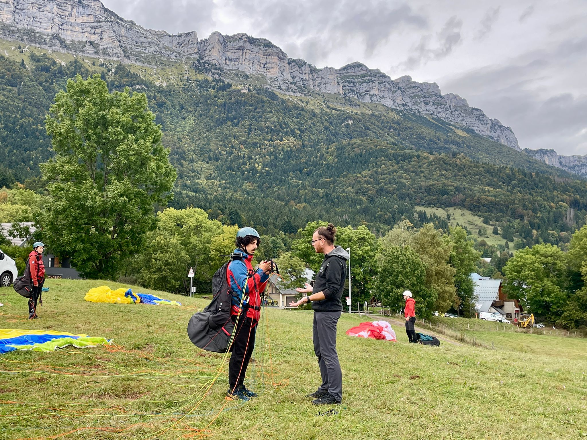

:::

. . .

::: { .right }

<br/>90 % restant ?

:::

. . .

::: { .right }

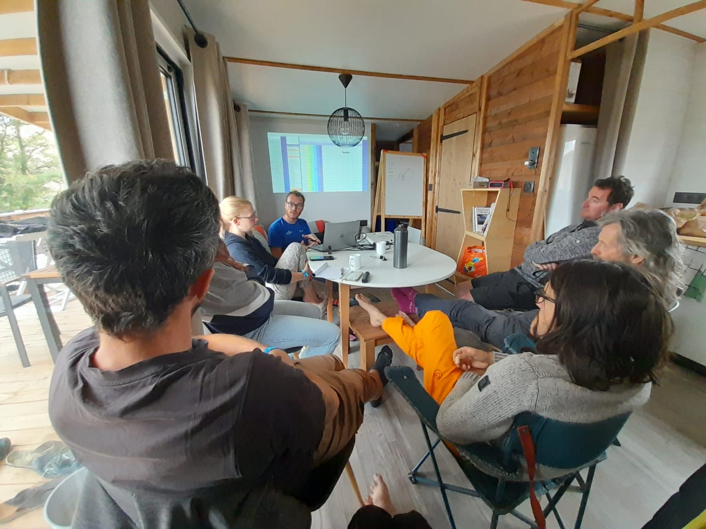

:::

::: notes
* Meteo
* Aerologie
* Meca Vol
* Legislation
* Facteurs humains
* Gestion du stress, de la fatigue, etc.
:::

## Aller vers l'autonomie { data-background-image="img/groupe_deco.jpg" }

::: { .left .background }
* Initiation

* Progression

* Perfectionnement

* Cross

* SIV

* ...
:::

. . .

::: { .right .background }

* Au début, découverte, petits vols, gestion du stress

* Puis apprendre à rester en l'air

* Puis apprendre à se déplacer, voyager !
:::


## Progression autonome

::: { .left .background }
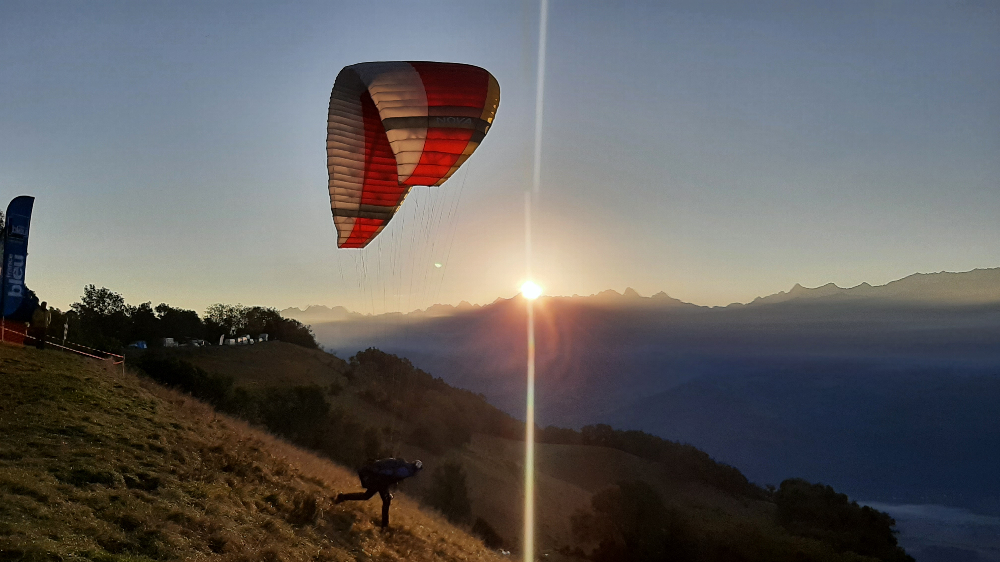

* Collecte d'informations
* Prises de décision
* Anticipation
* PLAISIR
:::

::: { .right .background }
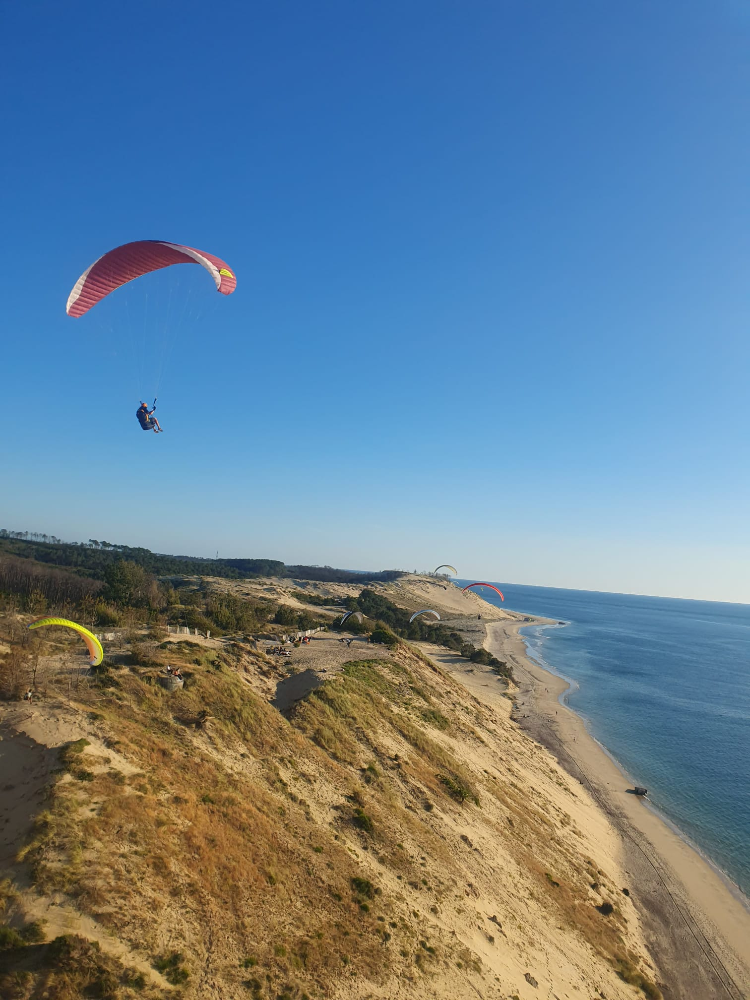
:::


## Eleves Sourds

Communication radio impossible.

::: { .left }
**Existant**

* Radios vibrantes (2 signaux possibles)

* Lunettes à LED gauche/droite

* WhatsApp
:::


::: { .right }
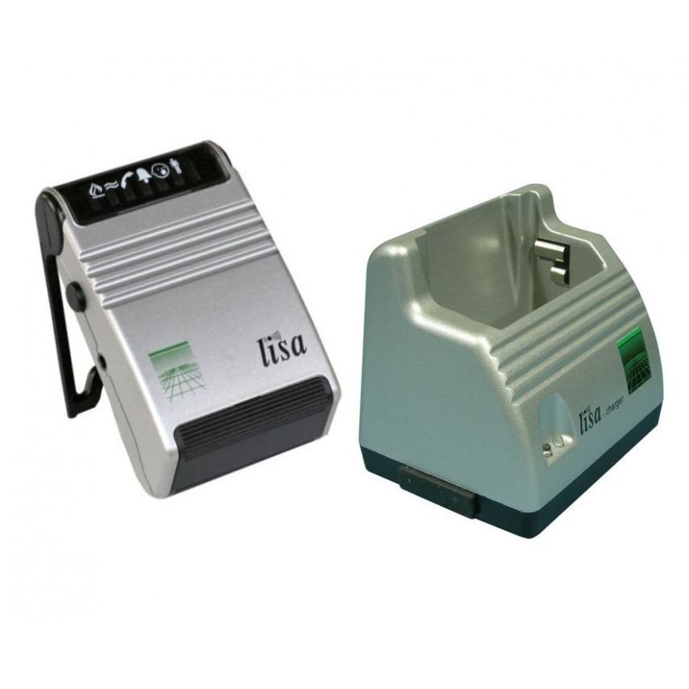{ style="height: 300px;" }

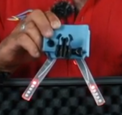
:::

## Besoins

::: incremental
* Communication unidirectionnelle
* Instantanée
* Indication précise si besoin (commande gauche, un peu plus...)
* Indication de haut niveau -> autonomisation
* Non intrusif (champ de vision)
* Intuitif pour l'élève et le moniteur
* Configurable en fonction du stage et de l'exercice
:::


# Système Luciole { data-background-image="img/jordan_raph.jpg"}

## Principe

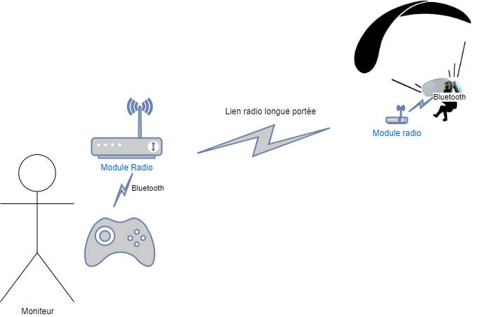{ style="height: 640px;"}

## Matériel

::: { .left }
* 2x systèmes radios
* Manette de jeu
* Lunettes ActiveLook
* Modules vibrants (bracelets)
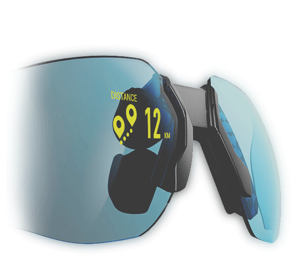
:::

::: { .right }
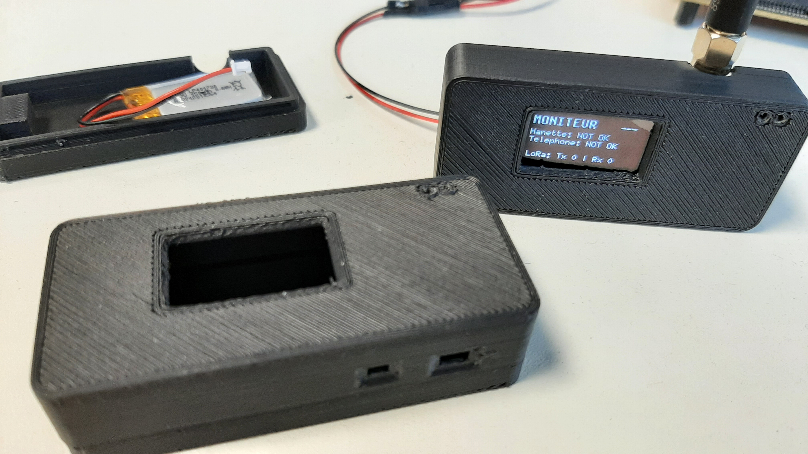
:::

## Fonctionalités
::: incremental
* Temps-réel : Vibrations

* Consignes haut-niveau : Lunettes

* Lien radio numérique
  * Adressage
  * Ack, renvoi de message
  * Heartbeat

* {style="height: 200px;" }
:::


# Rust Embarqué
{ style="height: 480px;"}

## Stack Technique

::: { .right }
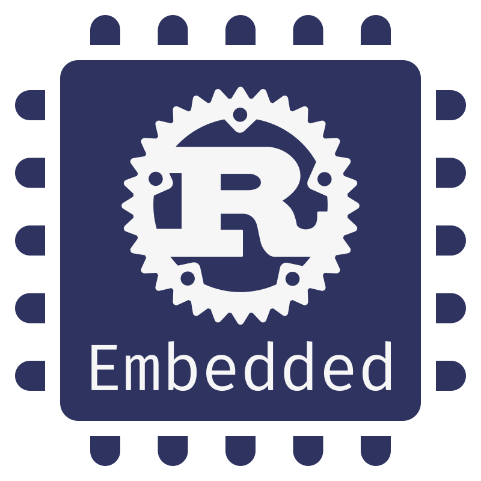
:::

::: { .left }
* `embedded-hal` v1.0 🥳

* Radios : cible ESP32 (xtensa)
   * SDK Espressif, surcouche Rust à esp-idf (FreeRTOS)

* Vibreurs : cible nRF52840 (arm cortex-M)
   * `embassy` EMBedded ASYnc :)
   * Blob BLE Nordic
:::

## Architecture Système { data-transition="slide-in fade-out" }
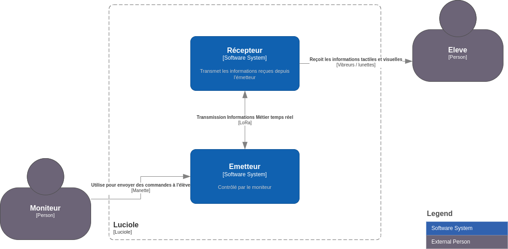

## Côté Moniteur -- Émetteur { data-transition="zoom-in fade-out" }
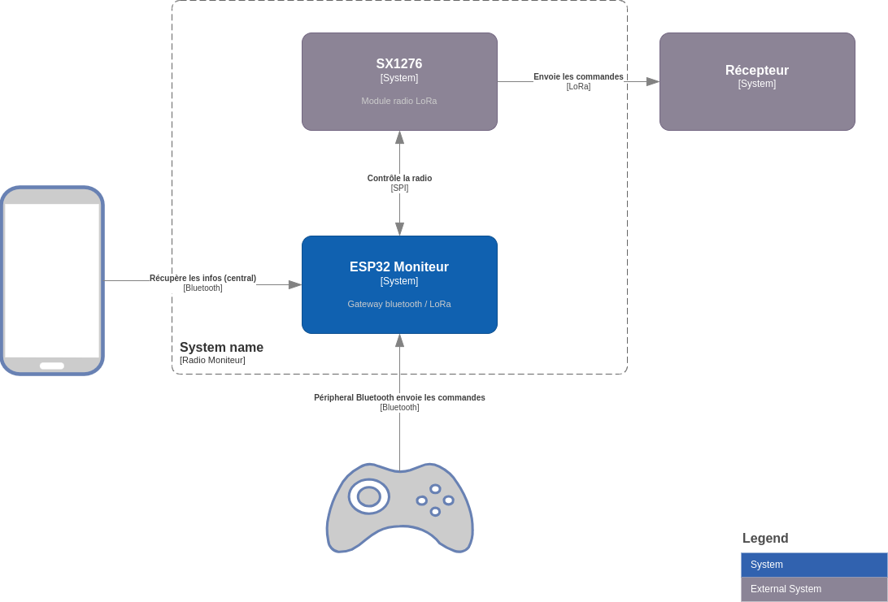{ style="height: 640px;" }

## Côté Moniteur -- Détails { data-transition="zoom-in slide-out" }
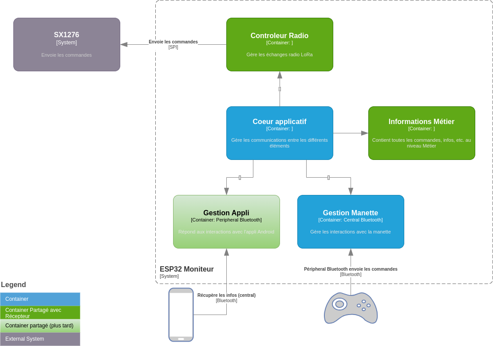{ style="height: 640px;" }

## Architecture Système { data-transition="slide-in fade-out" }


## Côté Élève -- Récepteur { data-transition="zoom-in fade-out" }
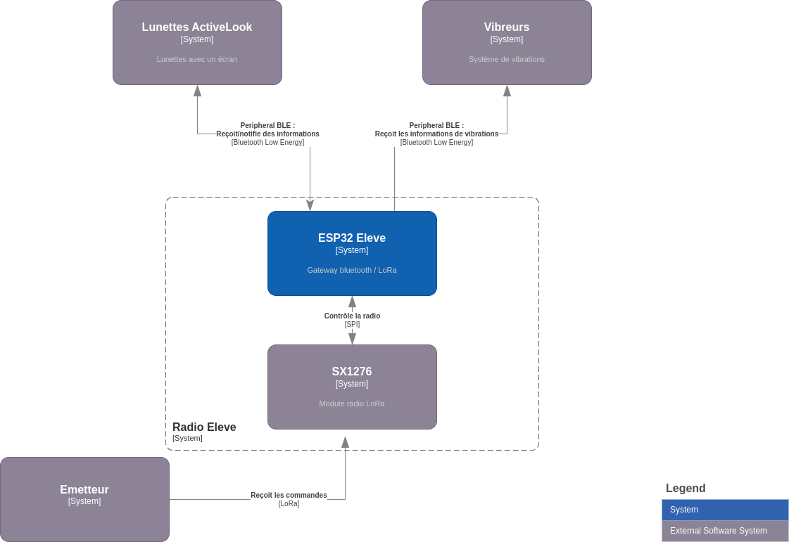{ style="height: 640px;" }

## Côté Élève -- Détails { data-transition="zoom-in slide-out" }
{ style="height: 640px;" }

## Côté Élève -- Trop de détails
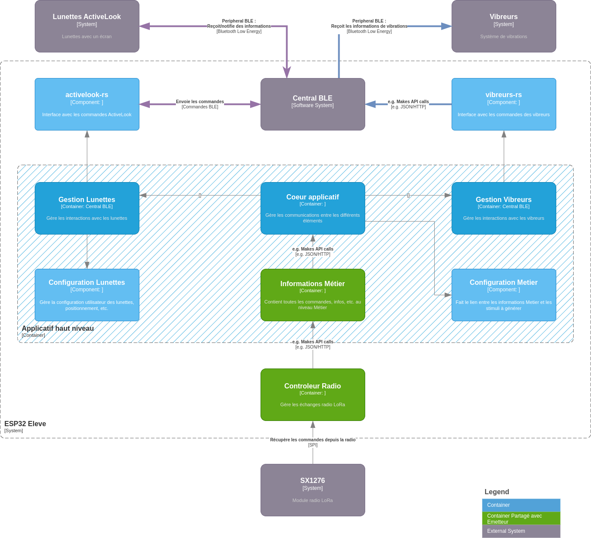{ style="height: 640px;" }

## Développement

* Tests sur PC de dev et CI/CD

* Réutiliser ce qui est possible
  * Extraire des crates `sx127x_driver`, `infos_metier`, ...

* Limiter le code hardware-dependant

* **Traits** :)

## Rust pour l´Embarqué

::: incremental
* **Traits** (interfaces)

* Ecosystème mature
  * `embedded-hal`
  * Cargo, `esp-rs`, etc.

* "Si ça compile, ça marche"

* Force les bonnes pratiques

* Stage de 5 mois -> Jordan (néophyte) produit un système qui fonctionne !
:::

# Lunettes ActiveLook
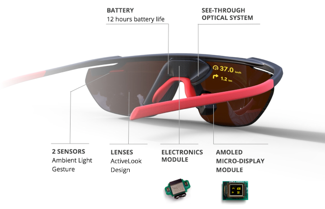{ style="height: 480px;" }

## Communication

::: { .left }
**SDK** Android & iOS

**BLE** [API](https://github.com/ActiveLook/Activelook-API-Documentation/blob/main/ActiveLook_API.md)

* Protocole bit-oriented
* Compliqué

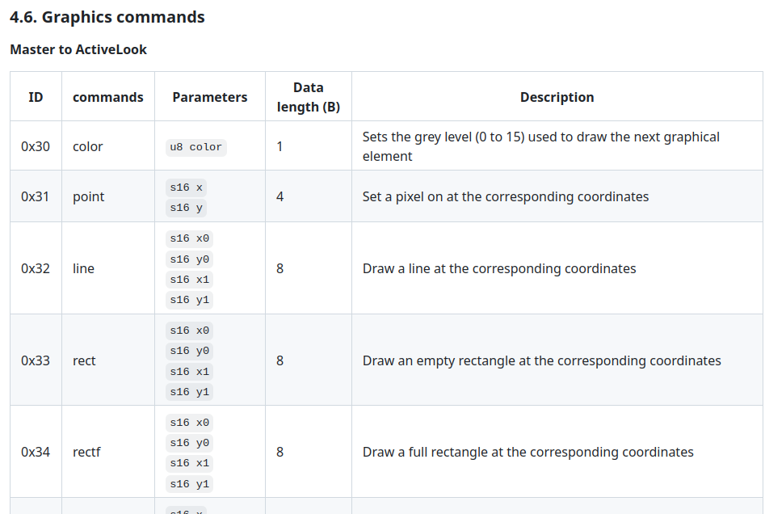{style="height:400px;" }

:::

. . .

::: { .right }
**Rust**

Crate `activelook-rs`

* Primitives haut-niveau
* Commandes, packets, protocole, ...
* Serialization avec `deku`

```Rust
pub enum Command {
    PowerDisplay { en: u8 },
    Clear,
    Rect { from: Point, to: Point },
    // And countless other commands
}
```
:::

## Problèmes de l'embarqué

* Une seule paire de lunettes

* Cycle relativement long (flasher la radio, reboot, connexion au lunettes, etc.)

* Très manuel

. . .

* Comment tester la crate `activelook-rs` ?

* Comment mettre au point les écrans pour l'application finale ?

## Tests

```Rust

    #[test]
    fn test_packet_serialization() {
        let expected = [0xFF, 0x00, 0x00, 0x06, 0x01, 0xAA];
        let expected_cmd = Command::PowerDisplay { en: 1 };
        let cmd = Command::PowerDisplay { en: 1 };
        let packet = Packet::new(&cmd);
        // Serialization
        let bytes = packet.to_bytes();
        assert_eq!(expected, bytes[..]);

        // Deserialization
        let newpkt = CommandPacket::from_bytes(&bytes).expect("Unable to deserialize");
        assert_eq!(expected_cmd, newpkt.data);
    }

```

## Émulateur ActiveLook

::: { .left }
* Serveur ØMQ
* Graphisme `nannou`
* Utilise `activelook-rs` et le protocole BLE comme le vrai HW
```Rust
let cmds = [
    Command::PowerDisplay { en: 1 },
    Command::Clear,
    // Outside
    Command::Rect {
        from: Point { x: 0, y: 0 },
        to: Point { x: 303, y: 255 },
    },
    // ...
];
for cmd in cmds {
    client.send(&cmd);
}
```
:::

::: { .right }
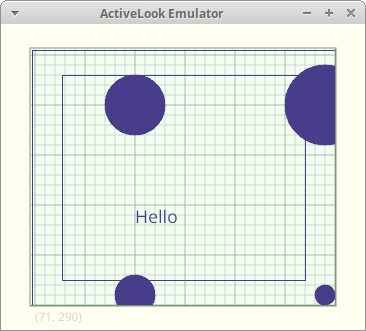{ style="height:480px;" }
:::


# Credits { data-background-image="img/lac.png" }

::: { .background }
jlg@jleguen.info
:::

## Crates

* [`embedded-hal`](https://docs.rs/embedded-hal/latest/embedded_hal/) Hardware Abstraction Layer (HAL) for embedded systems

* [`deku`](https://docs.rs/deku/latest/deku/) Declarative binary reading and writing
  * Voir aussi [`binrw`](https://docs.rs/binrw/latest/binrw/)

* [`nannou`](https://docs.rs/nannou/latest/nannou/) Creative-coding toolkit

* [`sx127x_lora`](https://docs.rs/sx127x_lora/latest/sx127x_lora/) Low-level driver for Semtech SX127x

* [`esp-rs`](https://github.com/esp-rs) Rust on Espressif µC

* [https://github.com/luciole-freeflight/](https://github.com/luciole-freeflight/)

## Graphics
- { style="height: 100px;" } [Rustacean.net](https://rustacean.net/)
- { style="height: 100px;" } [Ferris with soldering iron](https://waterpigs.co.uk/notes/5UrMgn/) Barnaby Walters
- { style="height: 100px;" } [Embedded Rust Working Group](https://blog.rust-embedded.org/)
