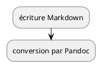

# La forge et ses pipelines

TODO: schéma de pipeline, avec plantUML ou mermaid



## Quelques exemples de Markdown

```markdown
# Un titre 1

Avec du texte d'introduction

- et des puces
- et du contenu

## Titre 2, imbriqué

Cette planche est de niveau inférieur, et donc en vertical dans l'affichage.

- [ ] liste à cocher, avec [un bête lien vers ce projet sur la Forge Kaizen][1]
- [x] avec des tâches complétées

[1]: https://forge.kaizen-solutions.net/-/ide/project/poles/pole-synergie/pr-sentations/presentations-sur-la-forge-kaizen/tree/1-creer-bases-de-la-presentation/
```
## Et un rendu sympa

- [ ] liste à cocher, avec [un bête lien vers ce projet sur la Forge Kaizen][1]
- [x] avec des tâches complétées

[1]: https://forge.kaizen-solutions.net/-/ide/project/poles/pole-synergie/pr-sentations/presentations-sur-la-forge-kaizen/tree/1-creer-bases-de-la-presentation/

## Et toutes sortes de plugins

https://plantuml.com/fr/activity-diagram-beta


# Mais quel intérêt ?

Ben oui, c'est quand même contraignant d'écrire en Markdown !

TODO: ajouter screenshot markdown

## Présenter du code facilement 

- coloration syntaxique 
- test des exemples de code

(voir section suivante)

TODO: ajouter screenshot code coloré

## Faire du suivi en version

gestion des évolutions :

- tickets
- requêtes de fusion

et ce bien sûr, en même temps que les évolutions de code

TODO: ajouter screenshot merge request, avec discussion

## Générer des présentations dans des pipelines

- mettre facilement à jour les modèles de document
- générer des documents depuis des fichiers textes

## Publier les présentations en ligne

- géré par la forge Kaizen : Gitlab pages

TODO: ajouter lien

ça marche aussi hors-ligne, le fichier peut être auto-porteur


# Comment ça marche

pipeline avec :

- [pandoc](https://pandoc.org) : convertit le Markdown vers une présentation Reveal.js
- [Reveal.js](https://reveal.js) affiche et anime des présentations dans les navigateurs modernes
- job spécifique Gitlab pages

TODO: ajouter screenshot pipeline


# Usage avec du code

## Exemple de code

```python
>>> def foo(bar: int) -> list[int]:
...     """Génère des kux sous forme d'entiers."""
...     return list(range(bar))
... 
>>> print(foo(8))
[0, 1, 2, 3, 4, 5, 6, 7]

```

## Et l'usage possible autour de ces codes

Le code de la planche précédente étant formatté comme du `doctest`,
Python peut tester ce code très facilement :

```
$ python -m doctest src/content.md
```

TODO: ajouter contenu du .gitlab.yml pour configurer le job de test
TODO: ajouter screenshot de la trace de test
TODO: ajouter screenshot avec tests foirés

Et ainsi valider que les exemples sont conformes 🤩
